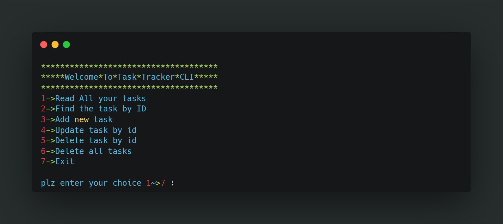
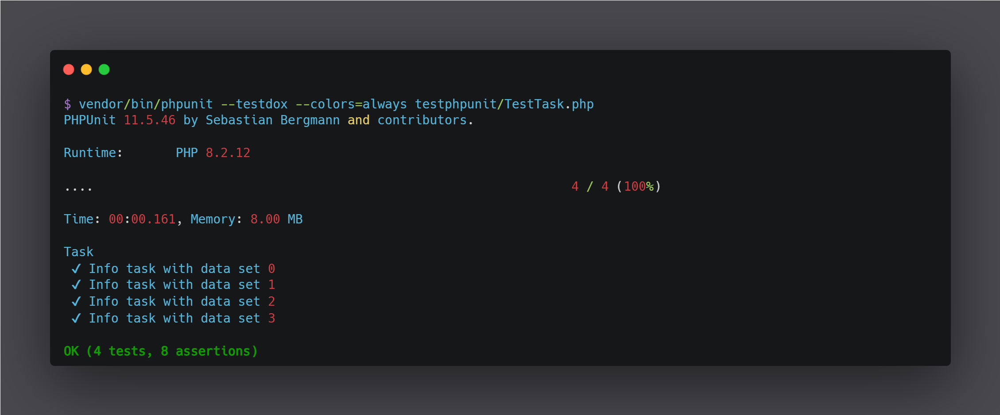

# PHP CLI Task-Tracker Manager

A **simple command-line interface (CLI) application** built in **PHP** for managing tasks. It allows users to **create, view, update, and delete tasks**, storing all data locally in a **JSON file**. This README provides a complete guide on how to install, configure, and use the application, along with a detailed overview of all its features.

---


## Table of Contents
- [Features](#features)
- [Installation](#installation)
- [optional](#optional)
- [Screenshot](#screenshot)
---

## Features
- Add new tasks  
- View all tasks  
- View tasks by status: **Todo**, **In-Progress**, **Done**  
- View task by **ID**  
- Update task details (**description** or **status**)  
- Delete tasks individually or clear all tasks  
- Automatically creates a **JSON file** if it does not exist  
- Data stored locally in a **JSON file** for simplicity  
- **Lightweight, fast, and easy to use** from the terminal  
- **Simple and friendly menu** for navigating commands 

---

## Installation
1. **Clone the repository**:  
```bash
git clone https://github.com/ibrahim5012/Task-Tracker.git
```

2. **run This Command to install composer**
```bash
    **install composer in your machine first if you dont have it !!

    composer install
```


3. **use this command to run but  must be in directory of App**
```bash
    php menu.php
```
## optional
1. **if you want to use PHPUnit you can install by this command**
```bash
    composer require --dev phpunit/phpunit
```

2. **run PHPUnit use this command**
```bash
    vendor/bin/phpunit --testdox --colors=always testphpunit/TestTask.php
```


## Screenshot


##


